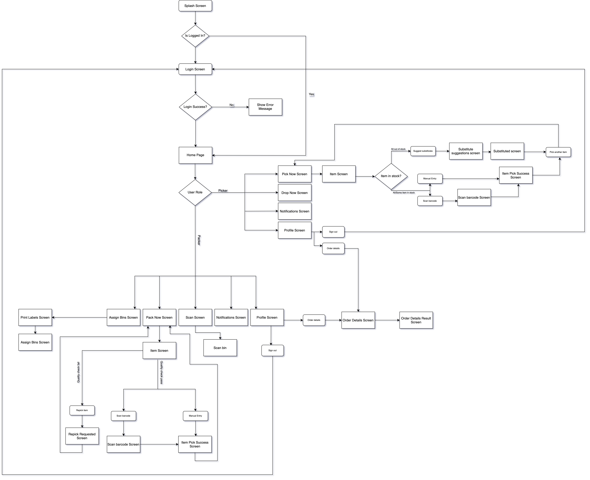

## Introduction

Nesto's Pick and Pack is app serves the roles of picking and packing as part of order fulfillment process.
The app supports 2 user roles respectively:

- Picker: responsible for picking the order items
- Packer: responsible for packing the order

## Basic workflow

The basic workflow is explained [here](https://docs.google.com/document/d/1cfu-OtxsM7tjjyAFNyDfAI48oqNYpBYF0aUosc_dJJY/edit).

## Workflow diagram

## Git branches

#### master

The current tip-of-tree, has all the features. Tested and stable. production released are tagged

#### LegacyCamera [ DEPRECATED ]

For legacy devices using camera for scanning. This branch is NOT up to date with latest features and is considered legacy since Zebra devices are being used for order fulfillment.

_For new developers, it is recommended to start a new **feature** branch based of **master** and work on
it._

## Technologies Used

[React Native](https://reactnative.dev/)

[react-native-firebase](react-native-firebase)

[@gorhom/bottom-sheet](https://gorhom.github.io/react-native-bottom-sheet/)

[react-navigation](https://reactnavigation.org/)

[axios](https://axios-http.com/docs/intro)

[moment-timezone](https://momentjs.com/timezone/)

[react-native-barcode-builder](https://www.npmjs.com/package/react-native-barcode-builder)

## Functions, Modules and APIs

Refer Sidebar
